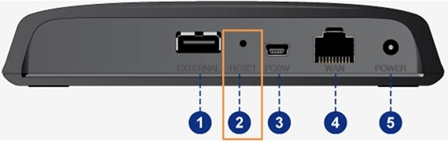

# SamsungSmartHub

Series of patches for [Samsung ODD](https://www.amazon.com/Samsung-SE-208BW-optical-SmartHub-streamer/dp/B007JUFLS0) based on [Topic](https://sites.google.com/site/tssthacks/home)

These patches resolves some of issues of SE-208BW:

    - missing auto-restart feature
    - mount scripts cannot handle multiple USB drives throush USB-HUB
        !!Note that if you connect multiple USBs via USB-HUB SE-208BW
         will erase all files from already mounted drives!!
    - config persistence as SE-208BW ocasionaly freezes and reboots into stock firmware
    - missing nfsd

Original firmwares [TW03](resources/SE-208BW_TW03.tar.gz)/[AW03](resources/SE-208BW_AW03.tar.gz),
Recovery firmwares [TW03](resources/SE-208BWTW_image.bin)/[AW03](resources/SE-208BWAW_image.bin)

Note that these binaries are no longer accessible on official Samsung sites.

### Patching firmwares

The SE208BW won't accept a firmware file if you have added too many files in the rd.gz file. It is important that the rd.gz firmware file is not larger than 13 megabytes.

### Brick recovery
Do not use the TW firmware if your device has pre-installed the AW firmware, and vice versa!

1. Download on of [TW03](resources/SE-208BWTW_image.bin)/[AW03](resources/SE-208BWAW_image.bin) based on your device.
2. Rename the downloaded file to 208BW_image.bin
3. Connect pc directly to your SE208BW using Ethernet cable.
4. Turn on your SE208BW while pressing the reset button with a pen as shown in image.

5. Change IP address settings by going in:
My network environment ->View network connection -> Local area connection -> Attribute for windows xp
Network and sharing center -> Change adapter settings -> Local area connection -> Attribute for windows 7 and 8
And changing settings to:
- IP address : 192.168.10.XXX (set “XXX” to any value but not 150)
- Subnet mask : 255.255.255.0
6. Open up http://192.168.10.150 in internet explorer, click browse and select downloaded bin file. (IE works most of the time others browsers may not work)
7. Click on send and wait until it finishes upgrading. There should be a countdown that says how much time remains. If there isn't type F5 to update the page.
8. If any error occured or recovery was not succesfull repear procedure again.
